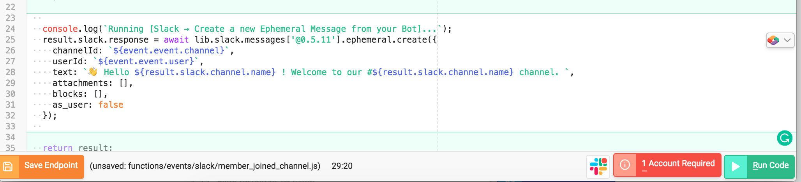
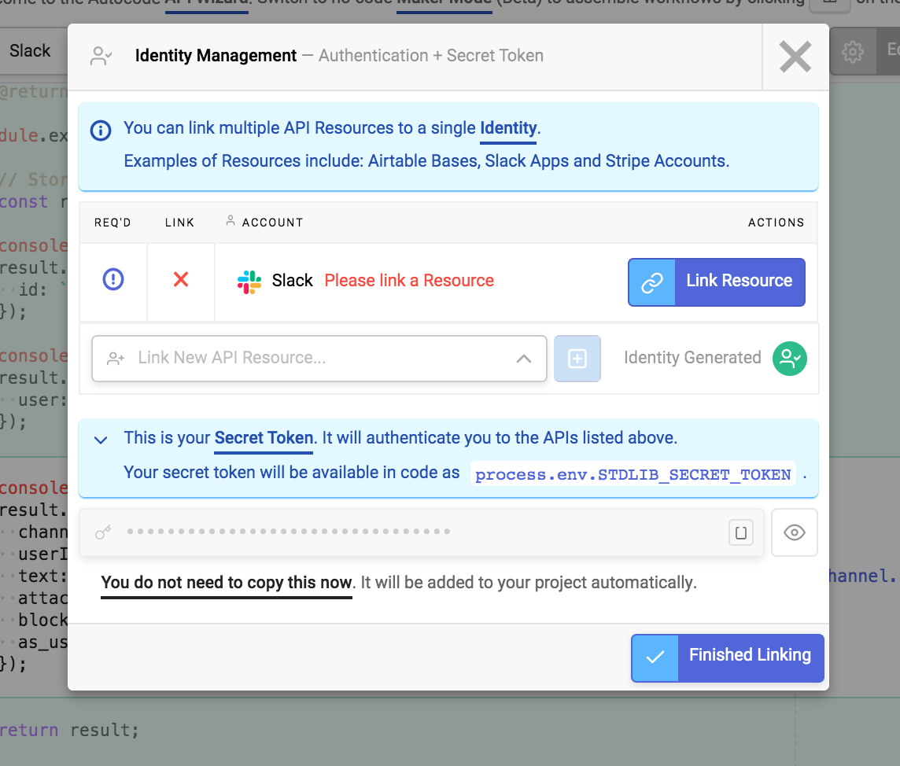
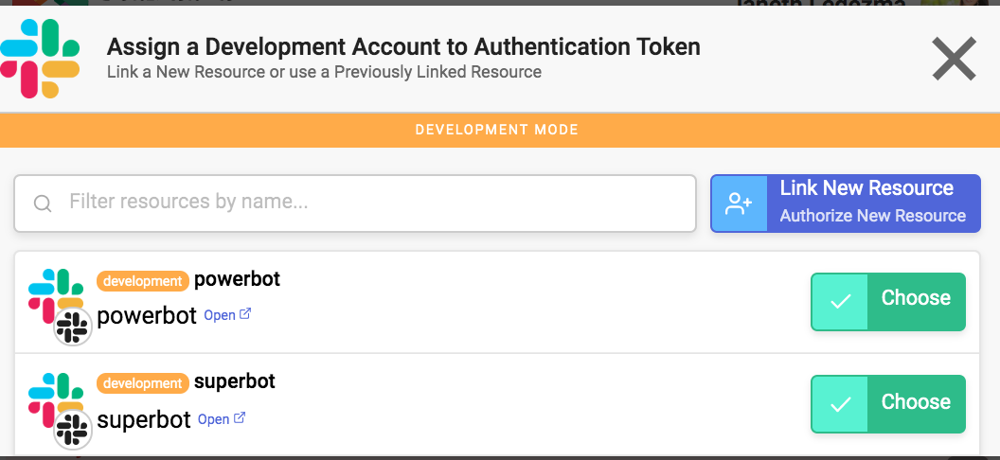
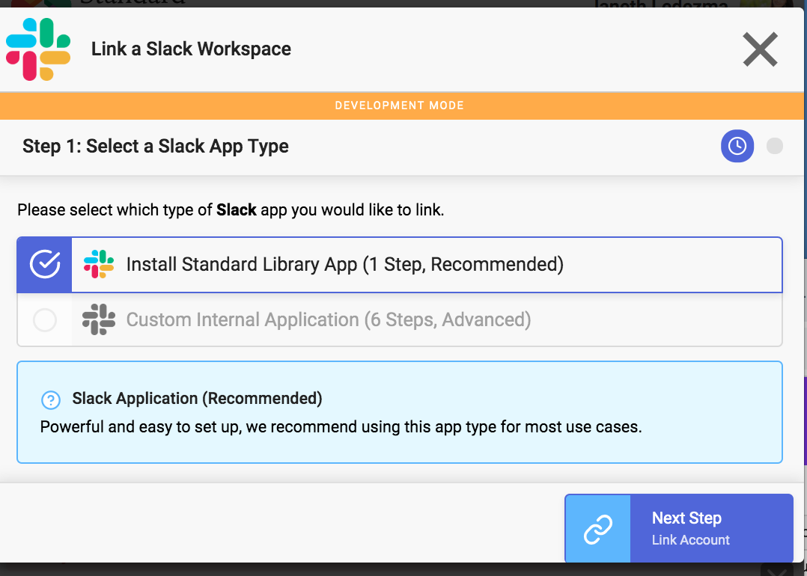
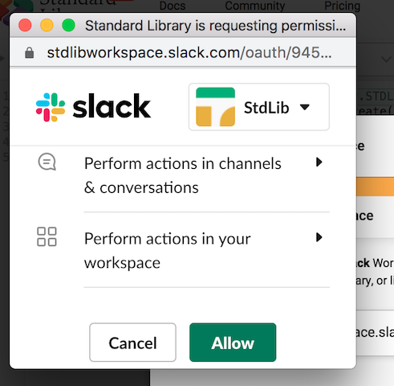
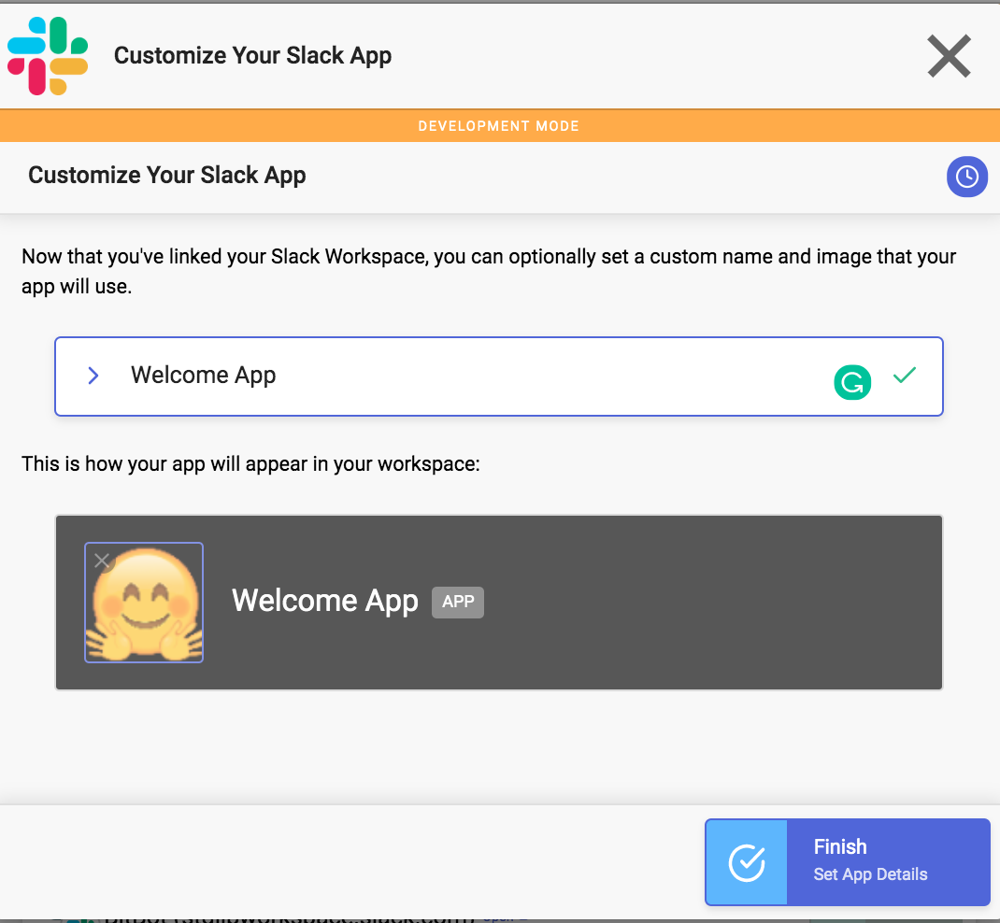
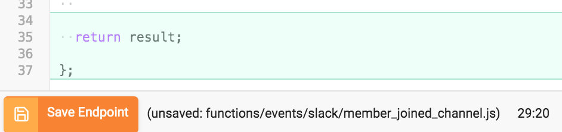
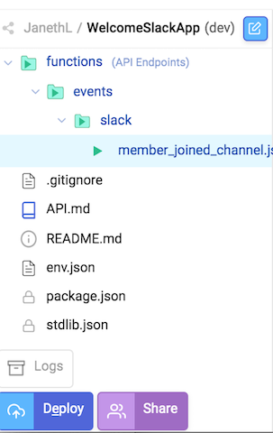
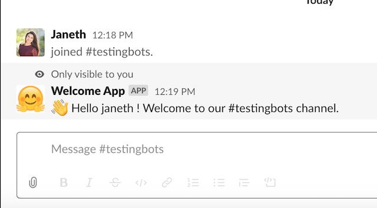

# README
[](https://deploy.stdlib.com/)

# 👋 Greet new members privately in Slack with Autocode + Block Kit Builder

In just a few steps, we will create a Slack app to privately welcome and guide new users when they join a Slack channel. We’ll breeze through the setup process, and you’ll be able to return to make modifications and add your own style and custom message for a unique workspace onboarding experience!

# Use Case


# Table of Contents

1. [How It Works](#how-it-works)
1. [Installation](#installation)
1. [Test Your Workflow](#test-your-workflow)
1. [Making Changes](#making-changes)
   1. [via Web Browser](#via-web-browser)
   1. [via Command Line](#via-command-line)
1. [Support](#support)
1. [Acknowledgements](#acknowledgements)

# How It Works
``` Javascript
1  const lib = require('lib')({token: process.env.STDLIB_SECRET_TOKEN});

3  /**
4  * An HTTP endpoint that acts as a webhook for Slack member_joined_channel event
5  * @param {object} event
6  * @returns {object} result Your return value
7  */
8 module.exports = async (event) => {

10   // Store API Responses
11  const result = {slack: {}};

13  console.log(`Running [Slack → Retrieve Channel, DM, or Group DM by id]...`);
14  result.slack.channel = await lib.slack.conversations['@0.2.5'].info({
15  id: `${event.event.channel}`
16  });

18  console.log(`Running [Slack → Retrieve a User]...`);
19  result.slack.user = await lib.slack.users['@0.3.32'].retrieve({
20    user: `${event.event.user}`
21  });

  
24  console.log(`Running [Slack → Create a new Ephemeral Message from your Bot]...`);
25  result.slack.response = await lib.slack.messages['@0.5.11'].ephemeral.create({
26    channelId: `${event.event.channel}`,
27    userId: `${event.event.user}`,
28    text: `👋 Hello ${result.slack.user.name} ! Welcome to our #${result.slack.channel.name} channel. `,
29    attachments: [],
30    blocks: [],
31    as_user: false
32  });
  

35  return result;

37 };
```
The first line of code imports an [NPM](https://www.npmjs.com/package/lib) package called “lib” to allow us to communicate with other APIs on top of Standard Library:

`const lib = require(‘lib’)({token: process.env.STDLIB_SECRET_TOKEN});` 

Line 3–7 is a comment that serves as documentation and allows Standard Library to type check calls to our functions. If a call does not supply a parameter with a correct (or expected type) it would return an error.

Line `8` is a function (module.exports) that will export our entire code found in lines 8–37. Once we deploy our code, this function will be wrapped into an HTTP endpoint (API endpoint) and it’ll automatically register with Slack so that every time a member_joined_channel event happens, Slack will send the event payload for our API endpoint to consume.

Lines `24–32` creates and posts your message using the information (parameters) that are passed in: channelId, UserId, Text.

You can read more about API specifications and parameters here: https://docs.stdlib.com/connector-apis/building-an-api/api-specification/

# Installation

Before we can deploy our code live, we need to Select the 1 Account Required red button which will prompt you to link a Slack account.




Select **Link Resource** from the Identity Management Screen



If you’ve built Slack apps with Standard Library, you’ll see existing Slack accounts, or you can select **Link New Resource** to link a new Slack app.



Select **Install Standard Library App**.



You should see an OAuth popup that looks like this:



Select **Allow**. You’ll have the option to customize your Slack app with a name and image.



Select **Finish**. The green checkmarks confirm that you’ve linked your accounts correctly. Click **Finished Linking.**


Select the orange **Save Endpoint** button.



Give your project a name and **Save API Project**.

Great! You’ve just saved your first project. Autocode automatically sets up a project scaffold to save your project as an API endpoint, but it hasn’t been deployed.

This means your endpoints are not yet live and can’t respond to HTTP requests or events. To deploy your API to the cloud select **Deploy API** in the bottom-left of the file manager.



🚀 **Congrats! Your App is Live** 

# Test Your Workflow

Test your Slack app by joining or leaving any channel in your workspace. If you’ve set everything up properly you should receive a warm welcome from your Slack app.



# Making Changes
# Support
# Acknowledgements
